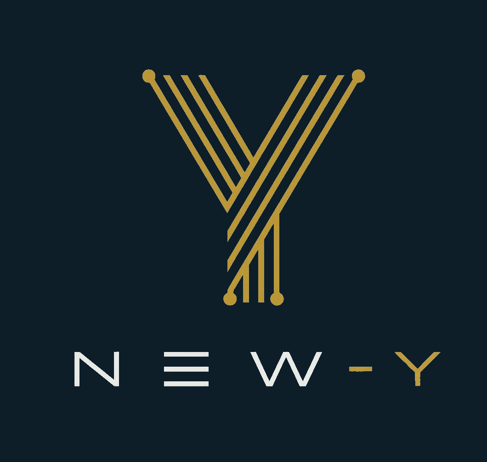

<picture>
  <source media="(prefers-color-scheme: dark)" srcset="docs/brand/new-y_logo_sign.png">
  
</picture>

# New-Y PowerApp

**Team Leader & Power Automate Expert:** Mario Martins

Multi-role sales management canvas app built with Microsoft Power Apps, SharePoint Online, and Dynamics 365 Business Central.

---

## Team

| Name | Role |
|------|------|
| **Mario Martins** | **Team Leader & Power Automate Expert** |
| Riccardo Casarotti | Tech Lead & Data Manager |
| Vinicius De Matos | Sr Dev & Layout Designer |
| Babacar Sy | Jr Dev & Power BI Specialist |
| Cristian Provenzano | Jr Dev & Tester |

---

## About / Informazioni

**EN** — New-Y PowerApp is a canvas application that manages the full sales cycle for a distribution business. It provides role-based interfaces for Agents, Office staff, and Managers, connected to SharePoint lists synced with Dynamics 365 Business Central.

**IT** — New-Y PowerApp è un'applicazione canvas che gestisce l'intero ciclo di vendita per un'azienda di distribuzione. Fornisce interfacce basate sul ruolo per Agenti, personale Office e Manager, collegata a liste SharePoint sincronizzate con Dynamics 365 Business Central.

**Tech Stack:** Power Apps · SharePoint · Power Automate · Power BI · Dynamics 365 BC

---

## Key Features / Funzionalità

### Role-Based Access (3 Ruoli)

| Role | Home | Access |
|------|------|--------|
| **Manager** | Dashboard (Power BI) | Orders, Customers, Reports, Products |
| **Office** | Product & Order management | Products, Orders, Customers |
| **Agent** | Customers & Products | Customers, Products |

### Architecture

```
Business Central (on-prem)
        │  PowerShell OData export
        ▼
SharePoint Lists (New-Y site)
  ├── Clienti-BC
  ├── Articoli-BC
  ├── Ordini-BC
  ├── RigheOrdini-BC
  ├── MovimentoArticoli-BC
  ├── Notifiche-BC
  ├── Riordini-BC
  └── UserRoles
        │  Power Apps connectors
        ▼
PowerApp Canvas (8 screens)
        │  Power Automate
        ▼
Flow #1 — Client Status Change (email to Manager)
Flow #2 — Stock Traffic Light (reorder alerts)
```

### Screens (8 total)
- `LOGIN` — SSO authentication with role assignment
- `scrLoading` — splash screen
- `HP-MANAGER` — role-based navigation hub
- `scrDashboard` — embedded Power BI (Manager)
- `scrOrders` — order management
- `scrCustomers` — customer management
- `scrProducts` — catalog with stock filters
- `scrReports` — BI reports

### Theme — TemaNewY
| Token | Color | Usage |
|-------|-------|-------|
| ScuroPrimario | `#0D1B2A` | Main background |
| BluPrimario | `#1B3A5C` | Containers |
| AccentiDorati | `#C9A227` | Gold accents |
| LuceSuperficie | `#F5F0EB` | Text on dark |

---

## My Contribution / Il Mio Contributo

**As Team Leader & Power Automate Expert:**

- Led a cross-functional team of 5 developers through the full project lifecycle
- Designed and implemented **2 Power Automate flows**:
  - **Client Status Change** — notifies Manager on customer status change requests
  - **Stock Traffic Light** — automated reorder alerts with Warning/Critical thresholds
- Architected the BC → SharePoint → PowerApp data pipeline
- Established the dark theme system (TemaNewY) and brand consistency
- Coordinated development, testing, and delivery

---

## Repository Structure

```
New-Y-PowerApp/
├── README.md                    ← This file (portfolio)
├── app/
│   ├── New-Y-PowerApp.msapp    ← Delivered binary (import into Power Apps)
│   ├── src/                    ← YAML screen source (8 screens)
│   ├── controls/               ← Control definitions
│   ├── references/             ← Data sources & theme references
│   ├── resources/              ← Publish info
│   ├── assets/images/          ← App images (24 files)
│   ├── Header.json
│   └── Properties.json
├── flows/
│   ├── flow1-client-status-change/
│   └── flow2-stock-traffic-light/
├── docs/
│   ├── brand/new-y_logo_sign.png
│   ├── architecture.md
│   ├── data-sources.md
│   └── user-manual.md
├── assets/
│   ├── sample-data/            ← CSV samples
│   └── screenshots/
└── presentation/
    └── New-Y-Final-Presentation.pdf
```

---

## Data Sources

| SharePoint List | BC Table | Description |
|----------------|----------|-------------|
| UserRoles | — | Authentication & role mapping |
| Clienti-BC | Customer | Customer master data |
| Articoli-BC | Item | Product catalog |
| Ordini-BC | Sales Header | Sales orders |
| RigheOrdini-BC | Sales Line | Order lines |
| MovimentoArticoli-BC | Item Ledger Entry | Stock movements |
| Notifiche-BC | — | App notifications |
| Riordini-BC | — | Reorder requests |

---

## Author

**Mario Martins** — Team Leader & Power Automate Expert

[](https://www.linkedin.com/in/mario-martins-7gs)

*ITS ICT Piemonte — Learning by Project · BAD 25-27*

---

## Tags

`#PowerApps` `#LowCode` `#PowerAutomate` `#SharePoint` `#BusinessCentral` `#PowerBI` `#CanvasApp` `#Portfolio` `#ITSICT` `#Microsoft365`

---

*Confidential — This repository contains project materials from the ITS ICT Piemonte Learning by Project program (BAD 25-27).*
